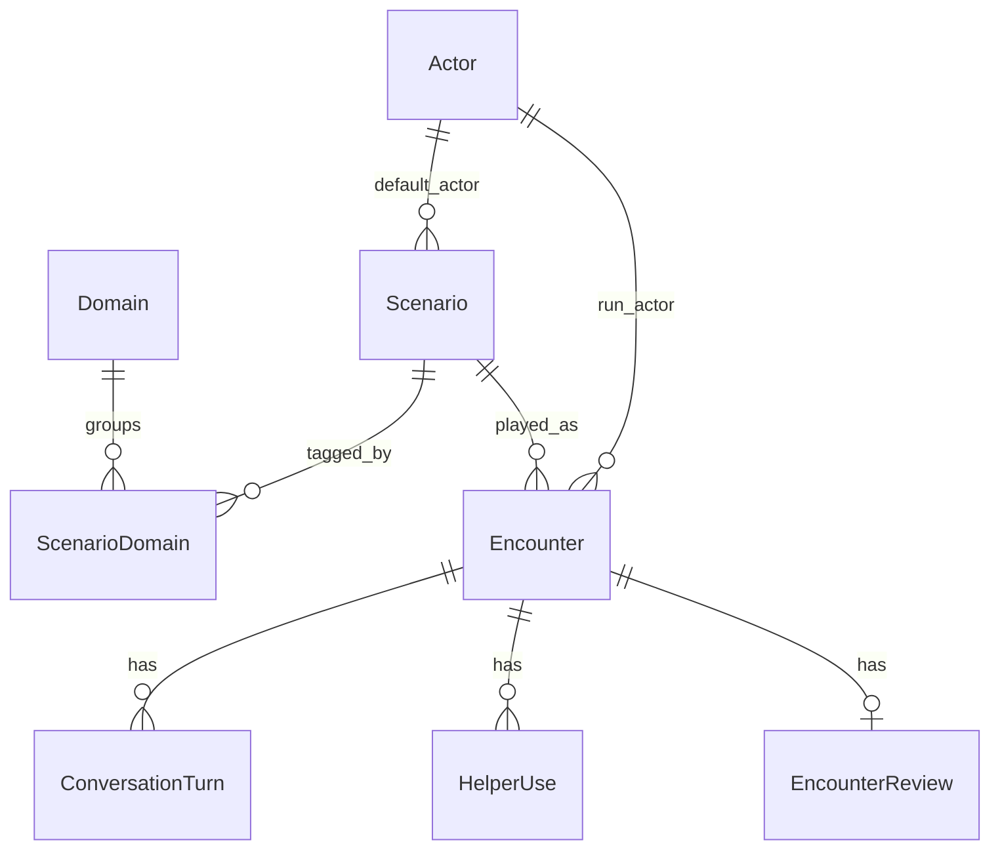

# Chatterbrain — Architecture

Clean architecture with feature modules aligned to the **Domain ⇄ Scenario ⇄ Encounter** taxonomy.

---

## 1. Purpose and principles

**Mission:** Help autistic users build social skills through repeatable, judgment-light practice.

**Design principles:**

1. **Safety first** — Private practice; supportive feedback; explicit difficulty.
2. **Feature modules** — `domain`, `scenario`, `encounter`, `actor`, `gamification` evolve independently.
3. **Thin framework layer** — `app/` and `actions/` delegate to read services / use cases.
4. **AI behind ports** — `DialoguePort`, helper adapters; swappable infrastructure.
5. **Reads vs writes** — Catalog reads use **read services**; mutations use **use cases**.

---

## 2. Domain model



| Concept            | Prisma model                                           | Feature module       |
| ------------------ | ------------------------------------------------------ | -------------------- |
| Social Domain      | `Domain`                                               | `features/domain`    |
| Playable situation | `Scenario`                                             | `features/scenario`  |
| User run           | `Encounter`                                            | `features/encounter` |
| Persona            | `Actor`                                                | `features/actor`     |
| Conversation aid   | `HelperUse` / `HelperId`                               | `features/helper`    |
| Practice mode      | `PracticeLane` on `Scenario` + snapshot on `Encounter` | enum                 |

**Many-to-many:** `ScenarioDomain` join table — scenarios are primary content; domains are metadata groupings.

**Lanes are separate:** A scenario has one `lane`; domains do not replace lanes.

---

## 3. Layered architecture

```
app/ + actions/
       ↓
composition/ (make*)
       ↓
presentation → application → domain ← infrastructure
```

| Layer              | Contains                                       | Must not            |
| ------------------ | ---------------------------------------------- | ------------------- |
| **domain**         | Entities, VOs, repository interfaces, machines | React, Next, Prisma |
| **application**    | Use cases, DTOs, read services                 | UI, route handlers  |
| **infrastructure** | Prisma repos, mappers, queries, AI adapters    | UI logic            |
| **presentation**   | Components, hooks, providers                   | Direct Prisma calls |

**Reads (catalog):** `ScenarioReadService`, `DomainReadService` — one service per aggregate, many methods.

**Writes:** `StartEncounterUseCase`, `CompleteEncounterUseCase`.

## 5. Folder structure

```
src/features/
├── domain/
│   ├── domain/entities/Domain.ts
│   ├── application/services/DomainReadService.ts
│   ├── infrastructure/repositories/PrismaDomainReadRepository.ts
│   └── presentation/hooks/
│
├── scenario/
│   ├── domain/entities/Scenario.ts
│   ├── application/services/ScenarioReadService.ts
│   ├── application/dto/ScenarioDetailResult.ts
│   ├── infrastructure/queries/scenario.queries.ts
│   └── presentation/hooks/
│
├── encounter/
│   ├── domain/entities/Encounter.ts
│   ├── domain/machines/encounter-machine.ts
│   ├── application/use-cases/
│   ├── infrastructure/repositories/
│   └── presentation/ (EncounterEngine, providers, composer)
│
├── helper/
│   ├── domain/ (HelperDefinition, HelperId)
│   ├── application/HelperRegistry.ts
│   └── (presentation helpers live in encounter composer + HelperProvider)
│
├── actor/
└── gamification/
```

```
composition/
├── domain/makeDomainReadService.ts
├── scenario/makeScenarioReadService.ts
└── encounter/makeStartEncounterUseCase.ts, makeCompleteEncounterUseCase.ts, ...

actions/
├── scenario/   listScenarios, getScenarioById
├── domain/     listDomains, getDomainWithScenarios
└── encounter/  startEncounter, getEncounterById, completeEncounter, getEncounters
```

---

## 6. Naming conventions

| Artifact      | Convention                            | Example                     |
| ------------- | ------------------------------------- | --------------------------- |
| Entity        | `PascalCase` in `domain/entities/`    | `Encounter.ts`              |
| Read service  | `*ReadService`                        | `ScenarioReadService`       |
| Use case      | `*UseCase`                            | `StartEncounterUseCase`     |
| DTO           | `*Result`, `*Input`                   | `ScenarioDetailResult`      |
| Repository    | `*Repository` / `Prisma*Repository`   | `PrismaEncounterRepository` |
| Query args    | `infrastructure/queries/*.queries.ts` | `scenario.queries.ts`       |
| React hook    | `use-kebab-case.ts`                   | `use-encounter.ts`          |
| Server action | verb noun                             | `startEncounter.ts`         |

**User-facing copy:** Domain, Scenario, Encounter, Actor, Helper, Practice Lane.

---

## 7. Data boundaries

- Prisma types stay in **infrastructure**; mappers produce domain entities / DTOs.
- `include` / `select` only in `infrastructure/queries/`.
- Cross-feature: presentation imports **application DTOs**, not other features' presentation.

---

## 8. Routing map

| UI                      | Route                              |
| ----------------------- | ---------------------------------- |
| Browse scenarios        | `/scenarios`                       |
| Scenario detail / start | `/scenarios/[id]/[slug]`           |
| Explore domains         | `/domains`                         |
| Domain detail           | `/domains/[slug]`                  |
| Active encounter        | `/encounters/[encounterId]`        |
| Encounter review        | `/encounters/[encounterId]/review` |
